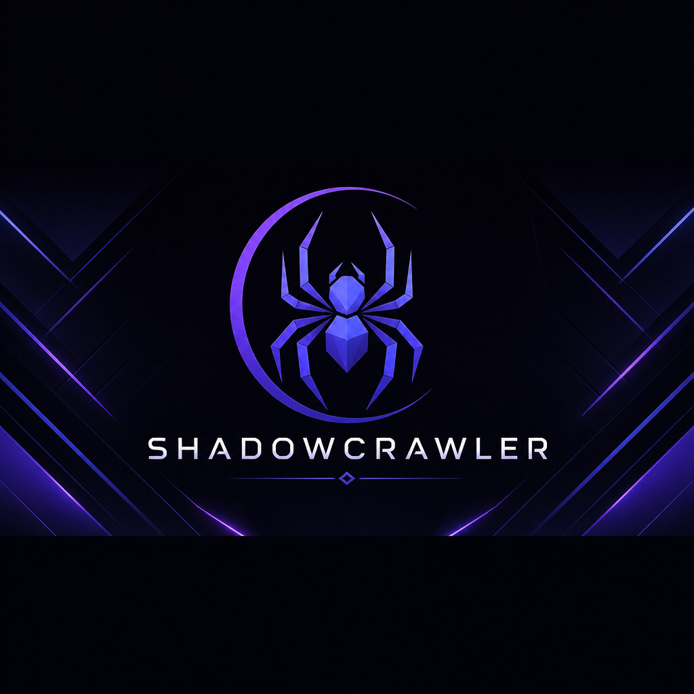
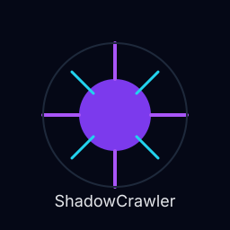

<p align="center">
  
</p>

# 🌙 ShadowCrawler  
**A modern, domain‑aware, hybrid web crawling framework for Python.**

<p align="center">
  
  
  
</p>

ShadowCrawler began as a small personal project — a quiet gift, a spark of affection — and unexpectedly grew into a full, modular, production‑ready crawling framework.  
It was built with care, curiosity, and intention.  
*Originally created for my guiding star, and built with the help of my AI copilot — a companion in code, clarity, and curiosity.*

---

## ✨ Features

- Automatic domain detection — run spiders without specifying them manually.  
- Hybrid fetcher (HTTP + Playwright) — fast when possible, browser when needed.  
- Persistent authentication — login once, session saved automatically.  
- Modular spiders — clean per‑domain architecture.  
- Media pipeline — automatic image/video/file extraction.  
- Checkpointing — resume crawls safely.  
- Full CLI toolkit — run, resume, inspect, list, stats, version.  

---

<p align="center">
  
</p>

## 🚀 Installation

```bash
pip install shadowcrawler
```

## ⚡ Quickstart

Run with automatic spider detection:

```bash
shadowcrawler run --url https://quotes.toscrape.com
```

Run with browser mode:

```bash
shadowcrawler run --url https://demoqa.com/login --browser
```

List spiders:

```bash
shadowcrawler spiders list
```

## 🕷 Creating a Spider

```python
from shadowcrawler.core.spider_base import SpiderBase

class QuotesSpider(SpiderBase):
    domain = "quotes.toscrape.com"

    async def parse(self, response):
        for quote in response.css(".quote"):
            yield {
                "text": quote.css(".text::text").get(),
                "author": quote.css(".author::text").get(),
            }
```

## 🔍 Domain Autodetection

ShadowCrawler automatically selects the correct spider based on the URL:

```bash
shadowcrawler run --url https://example.com/page
```

If your spider declares:

```python
domain = "example.com"
```

…it will be used automatically.

## 🌐 Fetch Modes

**HTTP Mode (default)**  
Fast, lightweight, ideal for most sites.

**Browser Mode**  
Powered by Playwright.  
Used automatically when:

- login is required  
- the site is dynamic  
- the spider requests browser mode  

## 🔐 Persistent Authentication

- Login once  
- Session saved to JSON  
- BrowserManager loads it automatically  
- AuthHandler detects login state  

## 🖼 Media Pipeline

Automatically extracts:

- images  
- videos  
- GIFs  
- downloadable files  

## 🧰 CLI Commands

```bash
shadowcrawler run
shadowcrawler resume
shadowcrawler download
shadowcrawler spiders list
shadowcrawler spiders create
shadowcrawler inspect
shadowcrawler stats
shadowcrawler version
```

## 📁 Project Structure

```bash
shadowcrawler/
  core/
  spiders/
  site_extractors/
  auth/
  cli/
  models/
  parsing/
  tools/
```

## 🕸 Included Example Spiders

- QuotesSpider  
- WikiSpider  
- HTTPNewsSpider  
- GallerySpider  
- AuthBrowserDemoSpider  

---

## 🗺 Roadmap

- [ ] PyPI release  
- [ ] Plugin system  
- [ ] Distributed crawling  
- [ ] Dashboard / Web UI  
- [ ] Cloud runner  
- [ ] Spider templates  
- [ ] Auto‑throttling  

---

## 📦 ShadowCrawler on itch.io

ShadowCrawler is distributed through itch.io, where you can get:

- The latest stable release  
- Optional Pro features  
- Example spiders  
- Early access builds  
- Support the project directly  

👉 Download or support the project on itch.io:  
https://shadowcrawlerframework.itch.io/shadowcrawler

---

## ☕ Support the Project

If ShadowCrawler has helped you or you want to support future development, you can leave a tip on Ko‑fi.

Every contribution helps keep the project alive and evolving.

<p align="left">
  <a href="https://ko-fi.com/shadowcrawlerframework" target="_blank">
    
  </a>
</p>

---

## 📜 License

ShadowCrawler is licensed under the Business Source License 1.1 (BUSL‑1.1).  
It will convert to Apache 2.0 on:

**November 16, 2030 — Allan’s 50th birthday.**
